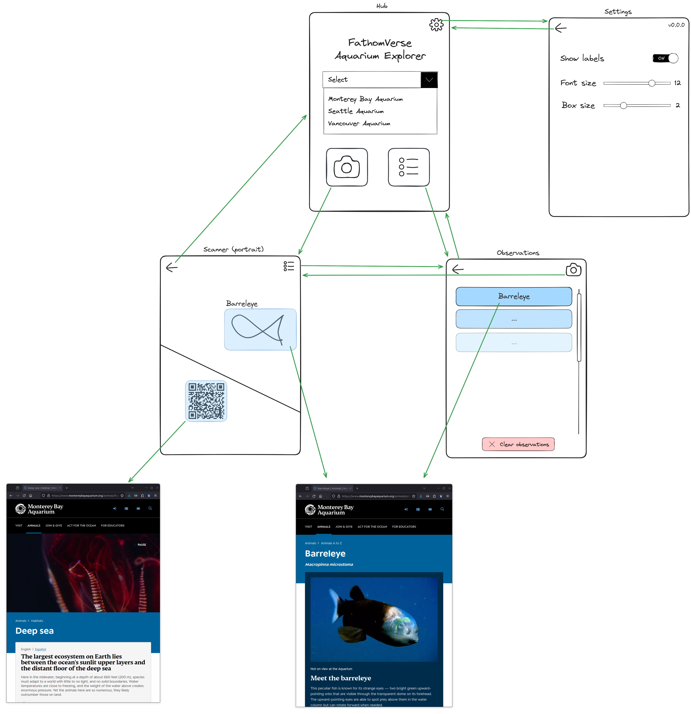

# Requirements

## Platform compatibility
- The app must be available for both iOS and Android platforms.
- The app must be implemented in Unity.

## Views

### Hub
- Initial view on app launch
- Provide combo box for selecting an aquarium model
- Include navigation to Settings, Scanner, and Observations

### Settings
- Include relevant accessibility settings
- Provide details about the app build, version, etc.
- Include navigation back to Home

### Scanner
- Display device back camera with relevant UI overlays (explained below)
- Include navigation to Home and Observations

### Observations
- Display list of scanned animals
- Provide clickable links to informational web pages for each scanned animal
- Include button to clear observations
- Include navigation to Home and Scanner

## Wireframe

## Functionality

### Hub model selection
- Get info for available models from a static MBARI-controlled endpoint on app launch
- Populate combo box with available models
- On selection, download model weights (via CloudFront URL provided in configuration) and cache on device

### Scanner
- Run QR code detector
    - For each detected QR code, draw box from 4 corners
    - On box click, go to link
- Run selected object detection model
    - Accelerate using on-device hardware and native device SDKs where available
    - For each detection
        - Draw bounding box and label
        - Add to observations
    - On bounding box click, open browser to informational web page about animal (URL provided in configuration)

## UI
Adhere to the FathomVerse style guide for consistent visual elements and branding.
